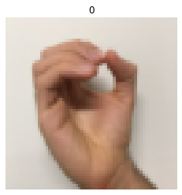
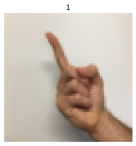
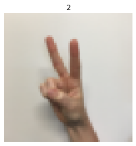
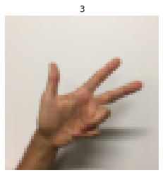
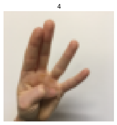
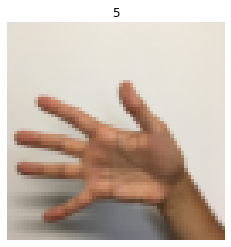
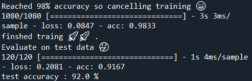

# Convolution NN for 0 to 5 sign language numbers classification
 

**Reached 98% accuracy on training set & evaluating the model using test set**

**Datasets**
* 1080 training samples
* 120 testing samples

**Technology**
* Tensorflow
